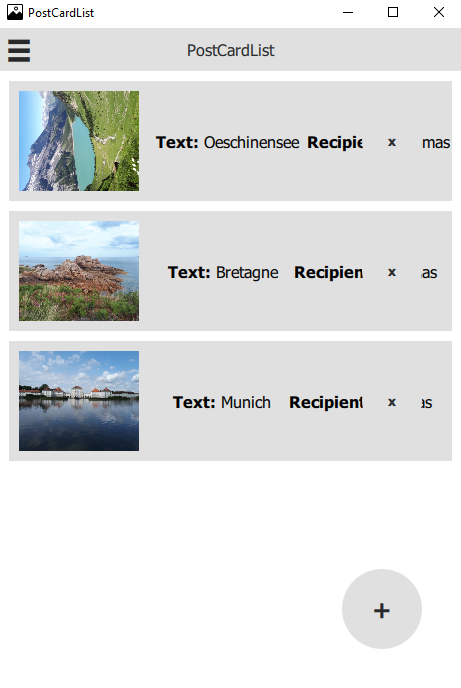

# PostCardList

Basic application where photos can be added to a waiting list and are periodically sent.
The Swiss Post offers a service to [send one free postcard per day](https://www.post.ch/en/about-us/news/news/2014/send-free-postcards-from-your-mobile-phone).
This app uses [postcard_creator](https://github.com/abertschi/postcard_creator_wrapper),
a Python wrapper around the API of the Swiss Post service, to order the postcards automatically
everyday.



## Installation

```bash
# Clone the repository
git clone https://github.com/Th-Havy/PostCardList.git
cd PostCardList

# Create a virtual environment
# Either Anaconda environment
conda create -n env python=3.9
conda activate env

# Or venv
# python3 -m venv env
# source env/bin/activate

# Install requirements
pip install -r requirements.txt
```

## Usage

```python
# in ..../PostCardList
cd src

# Launch app (it will keep running in the background)
python main.py
```

## Libraries

* **[Qt Quick](https://doc.qt.io/qt-5/qtquick-index.html)**: UI
* **[postcard_creator](https://github.com/abertschi/postcard_creator_wrapper)**: Python wrapper around the Postcard Creator API

## Author

* **Thomas Havy**
